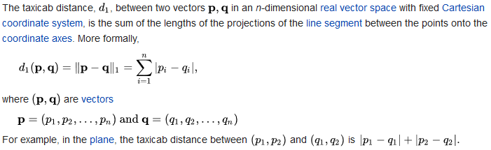
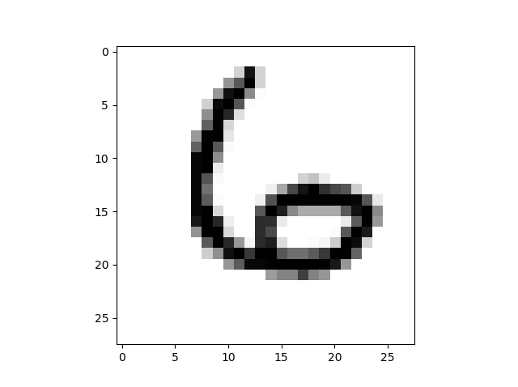

# Digit Recognizer
A "from-the-ground-up" implementation of the Kaggle [Digit Recognizer] problem in machine learning.

This is a Rust implementation of the initial hand-coded C# solution provided by Mathias Brandewinder in his book, _[Machine Learning Projects for .NET Developers]_.

From his description:

>What we have is a dataset of 50,000 images. Each image is a single digit, written
down by a human, and scanned in 28 x 28 pixels resolution, encoded in grayscale, with each pixel taking one of 256 possible shades of gray, from full white to full black. For each scan, we also know the correct answer, that is, what number the human wrote down. This dataset is known as the training set. Our goal now is to write a program that will learn from the training set and use that information to make predictions for images it has never seen before: is it a zero, a one, and so on. 
>
>Technically, this is known as a classification problem: Our goal is to separate images between known "categories," a.k.a. the classes (hence the word "classification"). In this case, we have ten classes, one for each single digit from 0 to 9. 

The solution provided here (See [src/main.rs]) does not use any libraries, hence the designation "from-the-ground-up." 

The cost function used is [Manhattan distance].

The cost function is a measure of how close the model's prediction is to the actual value. So the closer to zero the above function evaluates the more accurate the prediction. 

The output will look something like:

Digit: 8 - Match

Digit: 7 - Match

Digit: 2 - Match

Digit: 6 - Match

Digit: 3 - Match

Digit: 1 - Match

Digit: 2 - Match

...

...

Digit: 4 - Mismatch

Correctly classified: 96.30%

Here is a plot of one of the images. 

## Performance

How does the performance (timings) compare with the Python and C# versions? The C# version is from the  _[Machine Learning Projects for .NET Developers]_ book. The Python version you can find [here]. 

Python - 22s

C# - 1s

Rust Debug - 6s

Rust Release - 0.28s

Rust release builds are _[much]_ faster than debug builds.

>A release build typically runs much faster than a debug build. 10-100x speedups over debug builds are common!

[Machine Learning Projects for .NET Developers]: <https://www.apress.com/gb/book/9781430267676>
[Digit Recognizer]: <https://www.kaggle.com/c/digit-recognizer/overview>
[Manhattan distance]: <https://en.wikipedia.org/wiki/Taxicab_geometry#Formal_definition>
[src/main.rs]: <https://github.com/kevinmcfarlane/rust-digit-recognizer/blob/main/src/main.rs>
[here]: <https://github.com/kevinmcfarlane/digit-recognizer>
[much]: <https://nnethercote.github.io/perf-book/build-configuration.html>

